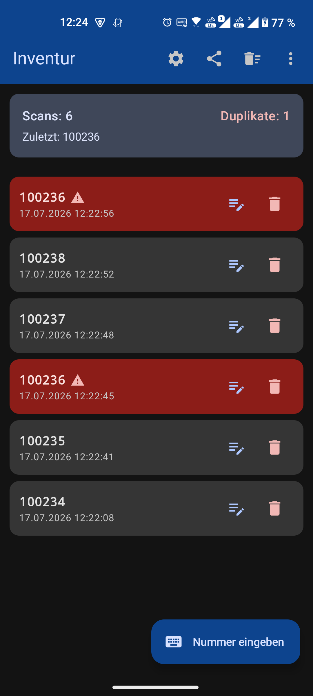
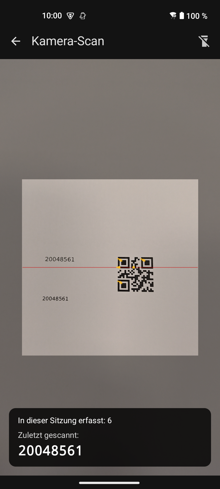
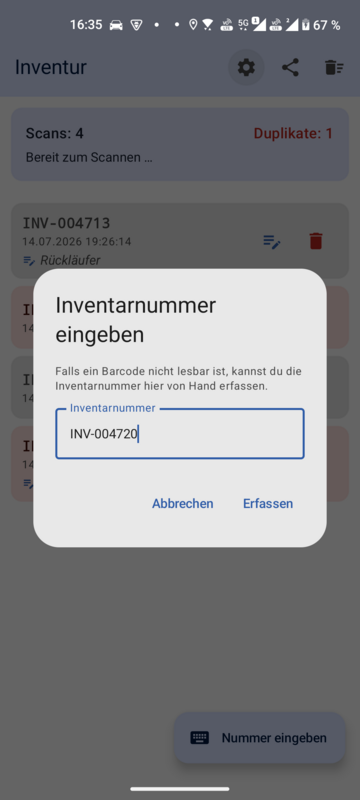
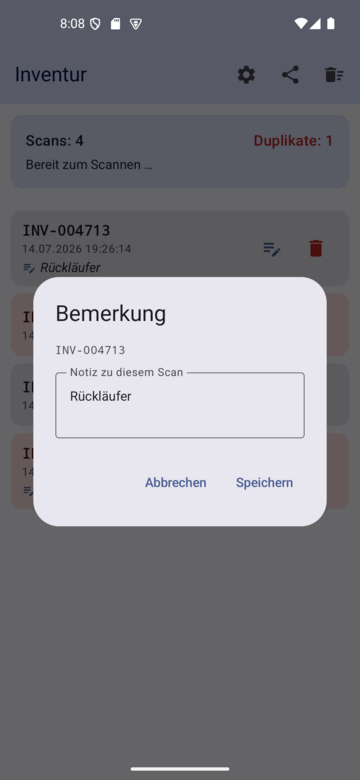
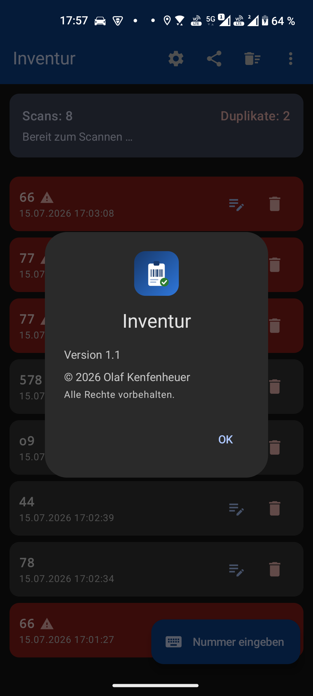
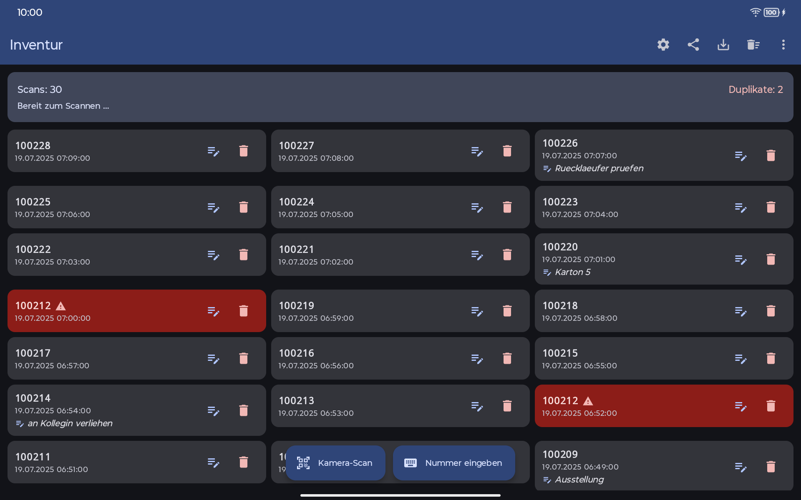
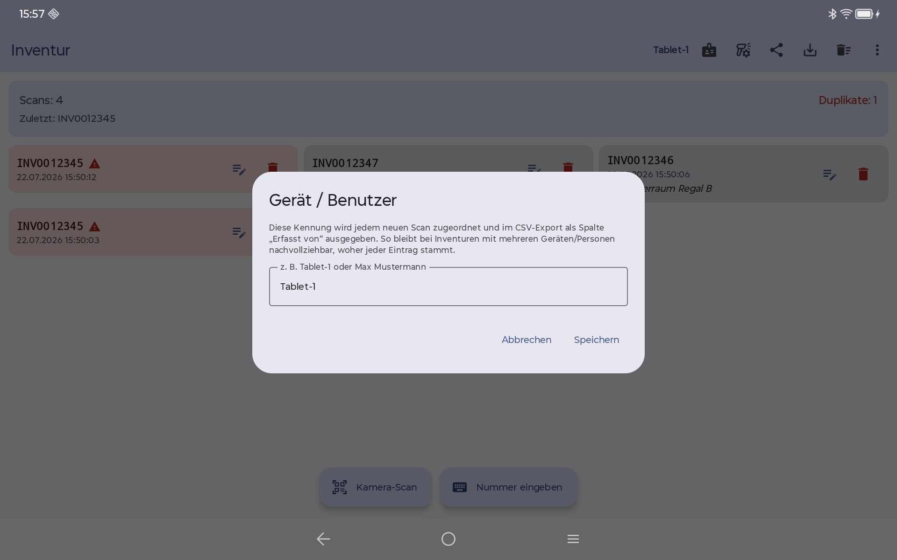
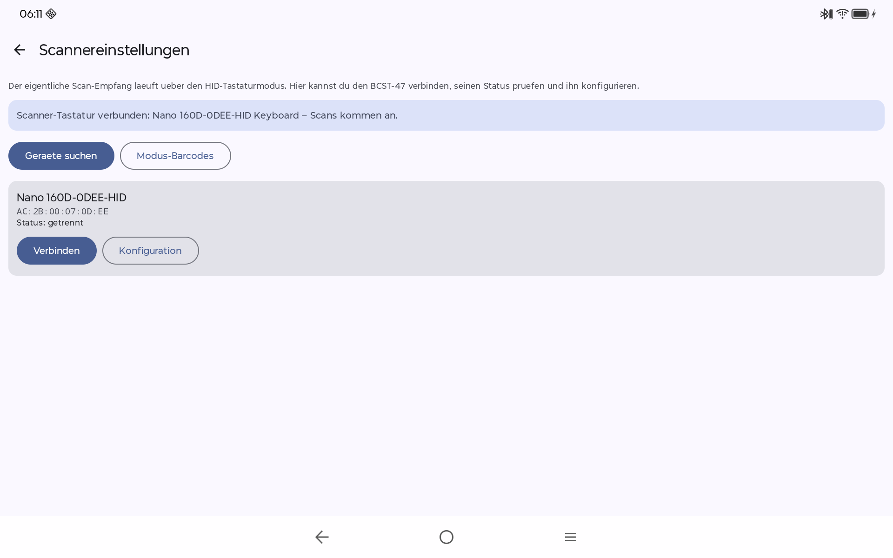
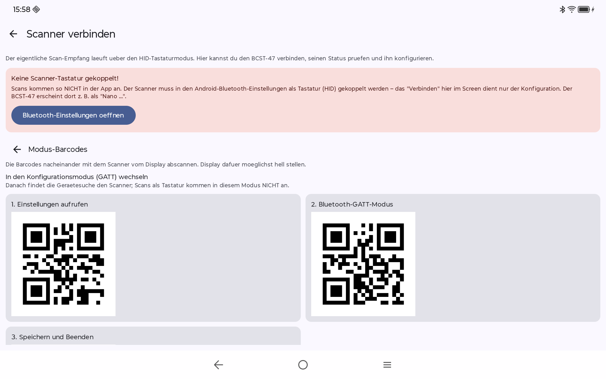
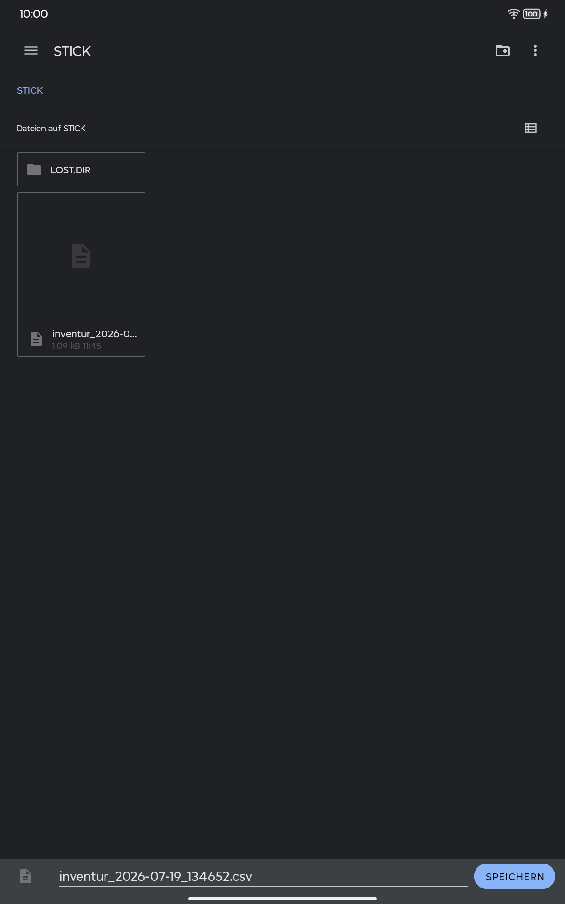

<p align="center">
  
</p>

<h1 align="center">Inventur</h1>

<p align="center">
  Android-App für die Inventur mit dem Bluetooth-Barcodescanner <b>Inateck BCST-47</b>.
</p>

## Überblick

**Inventur** ist eine schlanke Android-App, um bei einer Bestandsaufnahme
Inventarnummern per Bluetooth-Scanner, Gerätekamera oder von Hand zu erfassen.
Jede Nummer wird mit Datum und Uhrzeit als eigene Position gespeichert,
versehentliche Doppel-Scans werden erkannt und rot markiert, und die fertige
Liste lässt sich als CSV-Datei teilen oder speichern (z. B. per E-Mail oder auf
einen USB-Stick).

Für Inventuren mit **mehreren Geräten oder Personen** trägt jeder Scan eine frei
wählbare **Geräte-/Benutzerkennung** (CSV-Spalte „Erfasst von") – so bleibt beim
Zusammenführen der Listen nachvollziehbar, woher jeder Eintrag stammt.

Der Scanner koppelt sich als Bluetooth-Tastatur (**HID-Modus**) und „tippt" jede
Inventarnummer gefolgt von Enter – die App fängt diese Eingaben ab und trägt sie
automatisch in die Liste ein. Ein separater Scanner-Bildschirm nutzt das
[Inateck Scanner SDK](https://github.com/Inateck-Technology-Inc/android_sdk), um
den BCST-47 zu verbinden, seinen Status zu prüfen (Akku, Version) und ihn
vollständig zu konfigurieren – inklusive der Moduswechsel-QR-Codes direkt auf dem
Display.

📖 **[Bedienungsanleitung](docs/bedienungsanleitung.md)** ([PDF](docs/bedienungsanleitung.pdf)) ·
🎬 **[Demo-Video](https://github.com/olafkenfenheuer/inventur/releases/download/v2.1/inventur-2.1-demo.mp4)** ·
📦 **[Aktuelles Release](https://github.com/olafkenfenheuer/inventur/releases/latest)**

## Screenshots

### Smartphone

<p align="center">
  
  &nbsp;&nbsp;
  
  &nbsp;&nbsp;
  
</p>

<p align="center">
  
  &nbsp;&nbsp;
  
  &nbsp;&nbsp;
  
</p>

<p align="center">
  <i>Startbildschirm &nbsp;·&nbsp; Inventurliste &nbsp;·&nbsp; Kamera-Scan &nbsp;·&nbsp; Nummer von Hand eingeben &nbsp;·&nbsp; Bemerkung erfassen &nbsp;·&nbsp; Über die App</i>
</p>

### Tablet

<p align="center">
  
</p>
<p align="center">
  <i>Inventurliste mit Gerätekennung „Tablet-1" in der Kopfzeile, roten Duplikaten und Bemerkung</i>
</p>

<p align="center">
  
  &nbsp;&nbsp;
  
</p>
<p align="center">
  <i>Geräte-/Benutzerkennung festlegen &nbsp;·&nbsp; Scanner-Screen mit HID-Statusbanner</i>
</p>

<p align="center">
  
  &nbsp;&nbsp;
  
</p>
<p align="center">
  <i>Moduswechsel-QR-Codes (GATT ↔ HID) vom Display abscannen &nbsp;·&nbsp; CSV-Export auf USB-Stick</i>
</p>

## Funktionen

- **Scannen per HID-Tastaturmodus:** Der BCST-47 wird als Bluetooth-Tastatur
  gekoppelt und „tippt" jede Inventarnummer + Enter. Die App fängt das global ab
  (`MainActivity.dispatchKeyEvent`) und legt jeden Scan als eigene Position an.
- **Manuelle Eingabe** über den Button „Nummer eingeben": Ist ein Barcode
  beschädigt oder nicht lesbar, lässt sich die Inventarnummer von Hand erfassen.
  Sie landet über denselben Weg wie ein Scan in der Liste (inkl. Zeitstempel und
  Duplikat-Erkennung); während der Eingabe pausiert die HID-Scan-Erfassung.
- **Ein Eintrag pro Scan** mit sekundengenauem Datum/Uhrzeit – keine Mengen,
  Inventarnummern sind eindeutig.
- **Duplikat-Erkennung:** versehentlich doppelt gescannte Nummern werden rot
  hervorgehoben und als „Duplikate" gezählt.
- **Kamera-Scan:** Barcodes direkt mit der Gerätekamera einlesen – mit
  5-Sekunden-Entprellung gegen versehentliche Doppelerfassung.
- **Geräte-/Benutzerkennung:** frei wählbare Kennung in der Kopfzeile
  (z. B. „Tablet-1" oder ein Name); jeder neue Scan speichert sie zum
  Erfassungszeitpunkt. Ohne Kennung erinnert ein roter Hinweis.
- **Bemerkungen** je Scan – per Long-Press oder Bearbeiten-Button.
- **Löschen mit Bestätigung** (einzeln und ganze Liste).
- **CSV-Export & Teilen** (`;`-getrennt, UTF-8 mit BOM für Excel; Spalten:
  Nr, Inventarnummer, Zeitpunkt, **Erfasst von**, Bemerkung).
- **Persistenz:** die Liste übersteht einen Neustart (lokale JSON-Datei).
- **Scanner-Screen** mit Live-**HID-Statusbanner** (zeigt, ob Scans ankommen,
  inkl. Direktlink zu den Bluetooth-Einstellungen), **Modus-QR-Codes** zum
  Umschalten GATT ↔ HID direkt vom Display sowie einem vollständigen
  **Konfigurations-Panel** (Lautstärke, Vibration, Scan-Modus, Tastatur-Layout,
  Barcode-Typen u. v. m. – Werte-Semantik laut offizieller SDK-Doku).
- **Startbildschirm & „Über die App"** mit App-Version und Copyright-Hinweis
  (Menü oben rechts).

## So funktioniert das Scannen

1. In der Kopfzeile die **Geräte-/Benutzerkennung** festlegen (z. B. „Tablet-1").
2. BCST-47 im **HID-Tastaturmodus** mit dem Gerät koppeln – das Statusbanner im
   Scanner-Screen wird grün, sobald Scans ankommen (bei Bedarf über die
   Modus-QR-Codes bzw. „HID + Enter" umstellen).
3. App öffnen und scannen – die Inventarnummern erscheinen automatisch mit
   Zeitstempel in der Liste.
4. Ist ein Barcode nicht lesbar, über den Button **„Nummer eingeben"** die
   Inventarnummer von Hand erfassen (oder den **Kamera-Scan** nutzen).
5. Bei Bedarf Bemerkungen ergänzen und Fehlscans löschen.
6. Über das Teilen-Symbol die CSV exportieren – oder direkt speichern,
   z. B. auf einen USB-Stick.

## Architektur-Hinweis

Das Inateck BLE-SDK (`inateck-scanner-ble-2.0.0`) besitzt **keinen öffentlichen
Echtzeit-Callback für gescannte Barcodes** – interne Notify-Daten werden verworfen,
wenn gerade kein Konfigurationsbefehl läuft. Das SDK dient daher nur zum Verbinden,
Abfragen und Konfigurieren. Der eigentliche Scan-Empfang läuft über den
**HID-Tastaturmodus**. Deshalb der Hybrid-Ansatz.

Die nativen SDK-Bibliotheken (`libscanner_cmd.so`, JNA) liegen nur für
**arm64-v8a** vor (`abiFilters += "arm64-v8a"`). Der HID-/CSV-/Inventur-Kern
läuft dennoch auf jedem Gerät; nur die nativen Konfigurationsbefehle brauchen
arm64.

## Technik

- Kotlin, Jetpack Compose, Material 3
- minSdk 24, targetSdk 36
- SDK-Jars unter `app/libs/`, native Libs unter `app/src/main/jniLibs/arm64-v8a/`
- Abhängigkeiten: Inateck BLE-SDK, FastBle, Gson

## Build

```bash
./gradlew :app:assembleDebug
```

Benötigt ein vollständiges JDK 17+ (in Android Studio wird automatisch das
gebündelte JBR genutzt). Die fertige APK liegt danach unter
`app/build/outputs/apk/debug/app-debug.apk`.
